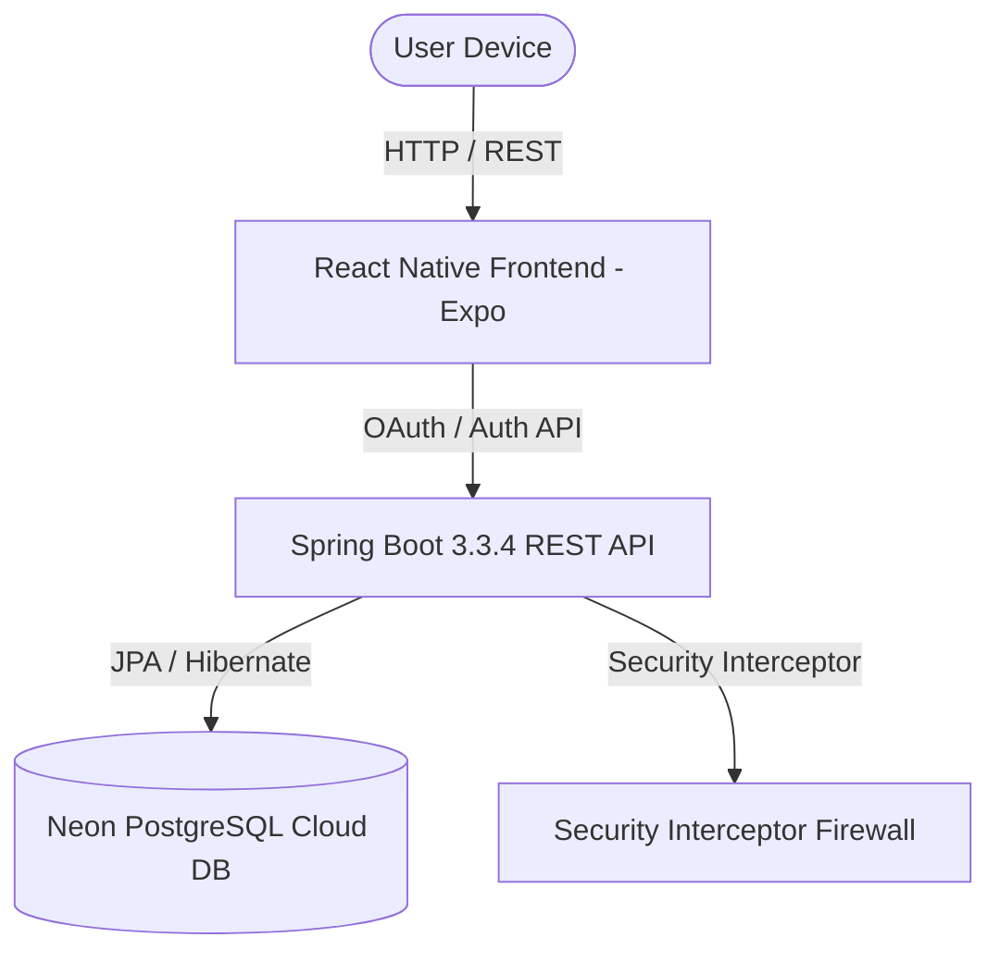

# 🚀 FreelanceFlow — Secure Freelancer Payment & Contract-Tracking System

[](https://spring.io/projects/spring-boot)
[](https://reactnative.dev/)
[](https://www.typescriptlang.org/)
[](https://neon.tech/)

> **SLIIT IT3060 — Human-Computer Interaction (HCI) Milestone 3**  
> An enterprise-grade, secure, multi-role freelance management platform featuring real-time contract tracking, escrow payments, dispute resolution, Google OAuth 2.0, and security incident response.

---

## 📖 Table of Contents

- [Key Features](#-key-features)
- [System Architecture](#-system-architecture)
- [Multi-Role Workflows](#-multi-role-workflows)
- [Technology Stack](#-technology-stack)
- [Directory Structure](#-directory-structure)
- [Getting Started](#-getting-started)
- [API Endpoints](#-api-endpoints)
- [Security Features](#-security-features)

---

## ✨ Key Features

### 🔐 Authentication & Identity Management
- **Google OAuth 2.0 Integration**: Authentic Google Accounts sign-in interface with domain typo validation (`.om` detection, fake email blocking) and multi-role selection.
- **Password Reset Flow**: 3-step password recovery system using 6-digit verification codes.
- **Role-Based Access Control (RBAC)**: Enforced across 4 distinct user roles (`FREELANCER`, `CLIENT`, `ADMIN`, `PAYMENT_STAFF`).

### 🛡️ Administrator Operations Center
- **Dynamic Security Incident Management**: Monitor IP threats, view audit logs, block/unblock suspicious source IP addresses with automated firewall interceptors.
- **Account Suspension Appeals**: Appeal management portal allowing suspended users to submit support tickets directly to administrators.
- **Financial Ledger & Dispute Oversight**: Escrow fund isolation and dispute resolution workflows.

---

## 🏗️ System Architecture



---

## 👥 Multi-Role Workflows

| Role | Key Capabilities | Primary Screen |
| :--- | :--- | :--- |
| 👨‍💻 **Freelancer** | Submit deliverables, track milestone escrows, view earnings | `/(tabs)/dashboard?role=FREELANCER` |
| 👨‍💼 **Client** | Create contracts, fund milestone escrows, approve deliverables | `/(tabs)/dashboard?role=CLIENT` |
| 🛡️ **Administrator** | Security logs, IP blocking, audit trails, user suspensions | `/admin-dashboard` |
| 💳 **Payment Staff** | Reconcile transactions, release escrow payments | `/staff-dashboard` |

---

## 🛠️ Technology Stack

### Frontend
- **Framework**: React Native with Expo Router (SDK 52)
- **Language**: TypeScript 5.3
- **Styling**: Design system tokens (`Colors`, `Theme`) with glassmorphism & responsive modals

### Backend
- **Framework**: Spring Boot 3.3.4 (Java 17 / 21)
- **Persistence**: Spring Data JPA with Hibernate ORM
- **Database**: Neon PostgreSQL Cloud Database

---

## 📂 Directory Structure

```
HCI-Milestone-3-WE_68/
├── backend/                        # Spring Boot REST API
│   ├── src/main/java/com/freelance/backend/
│   │   ├── config/                # Web & Security Interceptor Configs
│   │   ├── controller/            # REST Controllers (Auth, Admin, Support, etc.)
│   │   ├── dto/                   # Request & Response Data Transfer Objects
│   │   ├── entity/                # JPA Entities (User, BlockedIp, Dispute, etc.)
│   │   ├── repository/            # Spring Data Repositories
│   │   └── service/               # Core Business Logic Services
│   └── src/main/resources/
│       └── application.properties # PostgreSQL Database & Server Configs
│
├── frontend/                       # React Native Expo App
│   ├── app/                       # Expo Router Pages & Screens
│   │   ├── login.tsx              # Login Page
│   │   ├── register.tsx           # Registration Page
│   │   ├── admin-dashboard.tsx    # Admin Console
│   │   └── admin-security.tsx     # Admin Security Incident Center
│   ├── src/
│   │   ├── components/            # Reusable UI Modals (GoogleAuthModal, ForgotPasswordModal)
│   │   ├── constants/             # Colors & Theme Tokens
│   │   └── services/              # Axios API Client & Storage Service
├── .gitignore                      # Workspace Git Ignore Rules
└── README.md                       # Project Documentation
```

---

## 🚀 Getting Started

### Prerequisites
- **Node.js**: `v18.x` or later
- **Java JDK**: `17` or `21`
- **Maven Wrapper**: Included (`./mvnw`)

### 1. Backend Setup (Spring Boot)

```bash
cd backend

# Compile application
./mvnw clean compile

# Run Spring Boot server (Port 8080)
./mvnw spring-boot:run
```

### 2. Frontend Setup (React Native Expo)

```bash
cd frontend

# Install dependencies
npm install

# Start Expo Development Server
npm run dev
```

Open the Expo URL in your browser or mobile emulator.

---

## 📡 API Endpoints

### Authentication APIs (`/api/v1/auth`)
| Method | Endpoint | Description |
| :--- | :--- | :--- |
| `POST` | `/login` | Authenticate user with email and password |
| `POST` | `/register` | Register a new user account |
| `POST` | `/google` | Google OAuth 2.0 authentication & role routing |
| `POST` | `/forgot-password` | Generate 6-digit password reset verification code |
| `POST` | `/reset-password` | Verify code and update user password |

### Admin Security APIs (`/api/v1/admin/security`)
| Method | Endpoint | Description |
| :--- | :--- | :--- |
| `POST` | `/block-ip` | Block source IP address |
| `POST` | `/unblock-ip` | Unblock source IP address |
| `GET` | `/blocked-ips` | Fetch list of blocked IP addresses |
| `GET` | `/audit-logs` | Fetch system security audit logs |

---

## 🛡️ Security Features

1. **IP Firewall Interceptor**: Requests from blocked IP addresses are intercepted at the filter layer before reaching controller endpoints.
2. **Domain Typo Prevention**: Google authentication automatically rejects invalid domain typos (`gmail.om`, `gmai.com`) and disposable email providers.
3. **Password Security**: SHA-256 password hashing with zero plain-text storage.

---

## 📄 License
Developed for SLIIT IT3060 — Human-Computer Interaction (HCI Milestone 3). All rights reserved.
